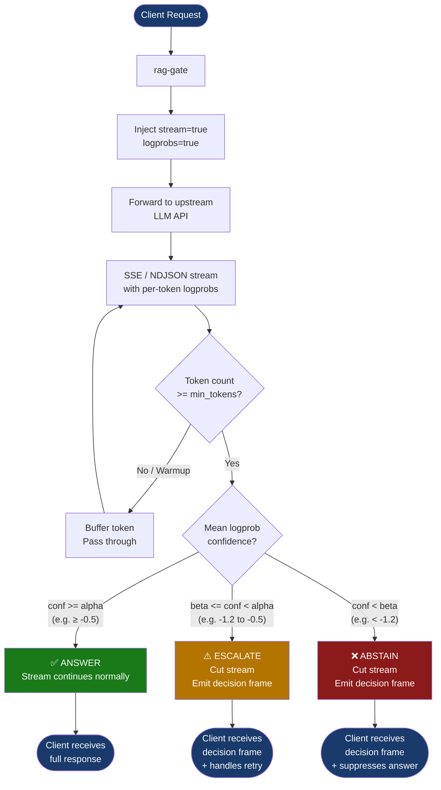

# rag-gate

A fast, asynchronous **inference-time** (while the model is actively generating tokens) **confidence middleware** that intercepts OpenAI-compatible LLM API streams, evaluates token-level logprob confidence in real time, and gates generation output into one of three decisions: **ANSWER**, **ABSTAIN**, or **ESCALATE**.

It uses a signal that's already computed for free during inference token logprobs as a real-time confidence gate, instead of a post-hoc LLM judge (expensive, slow) or a retrieval-score threshold (cheap, but empirically flat with model uncertainty).

It is not a model, and not a RAG framework. It's a wire-level proxy with one job: decide if the model is confident enough to trust.

## Status

Pre-1.0, but functionally verified. The core proxy, confidence evaluator, calibration endpoint, and stream chunk reassembly (see Known limitations) are implemented and tested including live end-to-end verification against a mock upstream and real OpenAI-compatible endpoints (historically xAI's Grok API; currently live-verified end-to-end — gating included — against `openai/gpt-4o-mini` via OpenRouter, with a decision frame firing on real logprobs). An Ollama `/api/chat` transport (NDJSON) is implemented and tested end-to-end against a mock Ollama upstream — but see Known limitations for why confidence gating is inert against Ollama today. Published on crates.io as `rag-gate`. Three upstream transports: OpenAI-compatible SSE, Ollama NDJSON, and Gemini native SSE (gating expected live on Vertex AI per Google's docs — synthetic-tested, live verification pending; forward-compatible on AI Studio).

## Quick start

Install the binary from crates.io:

```bash
cargo install rag-gate
RAGGATE_UPSTREAM_URL=https://api.openai.com rag-gate
```

Or build from source:

```bash
cargo build --release
RAGGATE_UPSTREAM_URL=https://api.openai.com ./target/release/rag-gate
```

Point your client at `rag-gate` instead of the upstream directly:

```bash
curl -N -X POST http://127.0.0.1:8080/v1/chat/completions \
  -H "Authorization: Bearer $OPENAI_API_KEY" \
  -H "Content-Type: application/json" \
  -d '{"model": "gpt-4o-mini", "messages": [{"role": "user", "content": "..."}]}'
```

`rag-gate` forwards the request upstream (auto-injecting `stream: true` and `logprobs: true`), streams the response back token by token, and — if confidence drops below threshold mid-stream — cuts the stream short and emits a decision frame instead of letting a low-confidence answer reach the client:

```json
{"rag_gate_decision": "ABSTAIN", "confidence_score": -1.47, "tokens_evaluated": 23, "threshold_used": -1.2}
```

## How it works



Confidence is the mean token logprob over the generated sequence so far:

```
confidence(tokens) = (1 / N) * Σ logprob(token_i)
```

```
confidence >= alpha        -> ANSWER    (stream continues normally)
beta <= confidence < alpha -> ESCALATE  (cut stream, emit decision frame)
confidence < beta          -> ABSTAIN   (cut stream, emit decision frame)
```

Evaluation happens incrementally per stream chunk, with a small lookahead buffer so tokens aren't forwarded before the first confidence check has a chance to fire.

A **warmup floor** (`min_tokens`, default 4) suppresses any ABSTAIN/ESCALATE until at least that many tokens have been evaluated: the mean over one or two tokens is too noisy to act on — a single low-probability opening token ("Well", "Hmm") shouldn't cut an answer that would have recovered. Set `min_tokens = 1` to disable.

Default thresholds: `alpha = -0.5`, `beta = -1.2`, `min_tokens = 4`.

## Configuration

Via `rag-gate.toml` in the working directory, or environment variables (env vars win):

```toml
[proxy]
listen_addr = "0.0.0.0:8080"
upstream_url = "https://api.openai.com"

inject_logprobs = true
max_body_bytes = 2097152
connect_timeout_secs = 10

[thresholds]
answer_alpha = -0.5
abstain_beta = -1.2
min_tokens = 4
degenerate_guard = true
```

| Env var | Overrides |
| --- | --- |
| `RAGGATE_CONFIG` | Path to the TOML config file (default: `rag-gate.toml`) |
| `RAGGATE_LISTEN_ADDR` | `proxy.listen_addr` |
| `RAGGATE_UPSTREAM_URL` | `proxy.upstream_url` |
| `RAGGATE_ANSWER_ALPHA` | `thresholds.answer_alpha` |
| `RAGGATE_ABSTAIN_BETA` | `thresholds.abstain_beta` |
| `RAGGATE_MIN_TOKENS` | `thresholds.min_tokens` |
| `RAGGATE_DEGENERATE_GUARD` | `thresholds.degenerate_guard` — detect the temperature-0/greedy logprob artifact (running mean ≈ 0 past 16 tokens), warn + disable gating for that stream (default `true`) |
| `RAGGATE_INJECT_LOGPROBS` | `inject_logprobs` — set `false` for upstreams that reject the logprobs field (e.g. Gemini's OpenAI-compat layer, or Gemini AI Studio's native endpoint where no model has logprobs enabled) |
| `RAGGATE_MAX_BODY_BYTES` | `max_body_bytes` — client request body cap (default 2 MiB) |
| `RAGGATE_CONNECT_TIMEOUT_SECS` | `connect_timeout_secs` — upstream connect timeout (default 10s) |

All incoming request headers except hop-by-hop headers (`Connection`, `Transfer-Encoding`, `Host`, etc.) are forwarded to the upstream as-is — so provider-specific auth headers like Azure's `api-key`, Anthropic-compat's `x-api-key`, and `OpenAI-Organization` pass through, not just `Authorization`. `rag-gate` never stores or logs API keys.

## Calibration

`POST /v1/rag-gate/calibrate` takes labeled samples (mean logprobs + correctness) and a target coverage, and returns threshold values that satisfy that coverage at (approximately) minimum risk, computed from an actual risk-coverage sweep with trapezoidal AURC integration:

```bash
curl -X POST http://127.0.0.1:8080/v1/rag-gate/calibrate \
  -H "Content-Type: application/json" \
  -d '{
    "target_coverage": 0.8,
    "samples": [
      {"correct": true, "logprobs": [-0.1, -0.2, -0.1]},
      {"correct": false, "logprobs": [-1.5, -2.2, -1.8]}
    ]
  }'
```

```json
{
  "optimal_alpha": -0.48,
  "optimal_beta": -1.15,
  "aurc_at_target_coverage": 0.143,
  "abstain_rate": 0.18,
  "escalation_rate": 0.06
}
```

See `test_calibrate.py` for a runnable example.

## Performance

Measured added latency (rag-gate vs. calling the upstream directly), release build, local loopback against a 20-token streamed response, 200 requests:

| Percentile | Added overhead |
| --- | --- |
| p50 | \~0.2–0.4ms |
| p99 | \~3.6–4.0ms |

Both comfortably under the &lt;5ms p99 target. This measures rag-gate's own processing cost (SSE parsing, confidence evaluation, buffering) in isolation; real-world overhead will also include whatever network hop is introduced by routing through the proxy, which depends entirely on your deployment topology (same-host vs. remote).

### Concurrent-stream throughput

`examples/throughput_bench.rs` measures the release binary under many simultaneous streams: a mock SSE upstream (15ms inter-token delay, 20 tokens/stream) runs in-process, the actual `target/release/rag-gate` runs as a subprocess, and each concurrency level takes the best of three interleaved direct-vs-proxied runs:

```bash
cargo build --release && cargo run --release --example throughput_bench
```

| Concurrent streams | Added p50 / p99 (ms) | Throughput vs. direct | Proxy RSS |
| --- | --- | --- | --- |
| 10 | ~15 / ~15 | ~97% | ~12 MB |
| 50 | ~3 / ~2 | ~99% | ~16 MB |
| 200 | ~0.5 / ~1.5 | ~95% | ~24 MB |

Throughput stays within ~5% of a direct connection at 200 concurrent streams, with sub-2ms added per-stream latency once past connection setup. Single-machine loopback, load generator and mock upstream sharing one process — treat exact values as indicative rather than lab-grade.

## Metrics

`GET /metrics` exposes Prometheus-format metrics:

| Metric | Type | Description |
| --- | --- | --- |
| `raggate_requests_total` | Counter | Total requests proxied |
| `raggate_decisions_total{decision}` | Counter | ANSWER / ABSTAIN / ESCALATE counts |
| `raggate_confidence_score` | Histogram | Distribution of confidence scores |
| `raggate_tokens_evaluated` | Histogram | Tokens evaluated before decision |
| `raggate_token_savings_total` | Counter | Tokens saved by cutting the stream early on ABSTAIN/ESCALATE |
| `raggate_degenerate_signal_total` | Counter | Streams where the logprob signal was degenerate (mean ≈ 0, likely temperature-0/greedy decoding) and gating was disabled |
| `raggate_no_logprob_signal_total` | Counter | Streams that requested logprobs but received zero — the upstream silently never emitted the field (not a degenerate value, an absent one); gating was inert for the whole stream |
| `raggate_proxy_latency_ms` | Histogram | Added latency vs. direct API call |

`GET /healthz` returns `ok` for liveness/readiness probes (no auth, no upstream call). The server drains in-flight requests on `SIGINT`/`SIGTERM` before exiting.

## Known limitations

- **Logprob access is the binding constraint on this whole project, and as of 2026-08-23 it is narrow — but a working free-tier-viable path is confirmed.** Verified live across every upstream this proxy talks to: OpenAI's free tier has no logprobs access at all (GPT-3.5 Turbo only, billing required for anything else), and logprobs are deprecated on OpenAI's GPT-5 reasoning line even for paid accounts. Anthropic's Claude API has never exposed logprobs on any endpoint. Gemini AI Studio (the free-API-key surface) has logprobs disabled on all 50 models probed (`benchmarks/gemini_logprob_probe.py`) — only Vertex AI (GCP billing + OAuth) supports it. Ollama has never returned per-token logprobs. Groq's entire current model catalog hard-rejects the `logprobs` parameter with a 400 across every chat model tested. **xAI's own line dropped it too**: `logprobs`/`top_logprobs` are silently ignored (not rejected) on grok-4.20 and newer, and `grok-3-mini` — the model this project's original benchmark evidence (`benchmarks/signal_decision.md`, `temperature_sweep_eval.py`, the historical Performance numbers below) was measured against — was retired 2026-08-15 and no longer appears in the API's model list; its Groq counterpart (`qwen/qwen3-32b`, used in the paper's Groq evidence trail) was independently deprecated 2026-06-17 for the same reason. **The confirmed working path: `openai/gpt-4o-mini` via OpenRouter** (`https://openrouter.ai/api/v1/chat/completions`) returns real per-token logprobs in the exact OpenAI shape rag-gate already parses — 9/9 live test calls succeeded with zero incremental cost registered against a $0 credit balance, likely a small free-trial allowance rather than a guaranteed-forever free tier. See `benchmarks/signal_decision.md`'s "Reference upstream retired" section for the full comparison table and next steps. **The sweep has since been re-run on this upstream (2026-08-23, n=100): ranking stable across ALL temperatures including 0 (AUROC 0.73–0.82, every CI far above 0.5), τ80 drift 0.72 nats re-confirming temperature normalization on a second model — and no temp-0 collapse on `gpt-4o-mini` (max |logprob| at temp 0 was 1.96, not ≈0), making the grok-3-mini hard-floor verdict provider/model-specific rather than universal. This is one additional data point, not a general "OpenAI-family models never collapse at temp 0" claim — the degenerate guard stays enabled by default precisely because that behavior is not yet known to generalize. Full tables and verdicts in `benchmarks/signal_decision.md`.** The `raggate_no_logprob_signal_total` guard below exists so any future upstream regression like this is visible rather than silent.
- The proxy cannot distinguish "upstream doesn't support logprobs" from "upstream silently ignores the request" by any means other than watching the response: `logprobs: true` (or `generationConfig.responseLogprobs`) is sent, and if a stream completes having produced at least one frame but zero logprobs were ever extracted, rag-gate logs a warning and increments `raggate_no_logprob_signal_total` rather than passing the stream through as a silent, ungated ANSWER. This does not fire when `inject_logprobs = false` was set deliberately (an expected zero-signal case) — only when logprobs were actually requested and never arrived.
- **Ollama's native** `/api/chat` **(NDJSON) is supported as a transport** — `rag-gate` reassembles its newline-delimited stream correctly. Confidence gating, however, is inactive against Ollama: it returns no per-token logprobs on either `/api/chat` or its OpenAI-compat `/v1/chat/completions` layer — the compat request field is silently dropped, and the feature request to add it was [closed as not planned](https://github.com/ollama/ollama/issues/16117) (see also [#13638](https://github.com/ollama/ollama/issues/13638)). With no confidence signal on the wire, the gate no-ops and every Ollama response passes through as ANSWER. The transport is in place, so gating will activate automatically if Ollama ever emits logprobs in the OpenAI shape.
- **Gemini's native API is supported as a third transport** (`streamGenerateContent?alt=sse`, both AI Studio `/v1beta/models/...` and Vertex `/v1beta1/projects/.../publishers/google/models/...` path shapes — the client's path, query, and auth headers are forwarded as-is, so use `x-goog-api-key` for AI Studio or OAuth `Authorization: Bearer` for Vertex). Gating status is asymmetric: every AI Studio model rejects logprobs with "Logprobs is not enabled" — verified live 2026-08-22 against all 50 models (see `benchmarks/gemini_logprob_probe.py`), so against AI Studio the proxy passes through ungated and auto-activates if Google flips the server-side flag. Vertex AI documents logprobs support (`generationConfig.responseLogprobs`), so the gate is *expected* to be live there — the gating logic is covered by synthetic-frame tests, but the Vertex path has not been live-verified through rag-gate yet (no OAuth-credentialed upstream on hand). Non-streaming `generateContent` is rejected (501) — rag-gate gates streams only.
- Not every "OpenAI-compatible" API accepts the auto-injected `logprobs: true` field — Google's Gemini OpenAI-*compat* layer rejects it with a 400. Set `inject_logprobs = false` (or `RAGGATE_INJECT_LOGPROBS=false`) for those upstreams; gating then only fires if the client itself requests logprobs. (The native Gemini route above injects `generationConfig.responseLogprobs` instead — for AI Studio, where no model accepts it today, the same flag disables that injection.)
- **Confidence is temperature-dependent.** Mean token logprob rises toward 0 as sampling temperature drops (at temperature 0 the model always picks the argmax token, whose logprob is near 0). So a pipeline running the upstream at very low temperature will see near-perfect confidence on nearly everything and the gate will rarely fire — calibrate your thresholds at the temperature you actually serve at, and re-calibrate if you change it. (This also means "just retry at a lower temperature" is not a reliable recovery strategy — it inflates the confidence score without necessarily improving the answer; see `benchmarks/`.) The proxy detects the fully-degenerate case: if the running mean is still ≈ 0 after 16 tokens, it logs a warning, increments `raggate_degenerate_signal_total`, and stops gating that stream rather than silently passing everything as ANSWER. Disable with `RAGGATE_DEGENERATE_GUARD=false`. A systematic measurement of how much signal survives at intermediate temperatures is pre-registered in `benchmarks/signal_decision.md` (see `temperature_sweep_eval.py`).
- Escalation routing (automatic retry/reroute to a fallback model on ESCALATE) is not yet implemented — the client currently has to handle that itself, and the evidence so far does not justify building it. Two recovery strategies were evaluated (see `benchmarks/`): a `lower_temperature` retry, which is *mechanistically* disqualified because low temperature inflates the confidence metric without necessarily improving the answer; and **rerouting to a stronger model** (`grok-3-mini`→`grok-4.5`, 45-question low-confidence band), which moved band accuracy 35.6%→42.2% but with **6 fixes against 3 regressions — net +3, McNemar p = 0.51, not significant**. Rerouting is not a free win (it also breaks answers), so neither strategy is currently shipped.
- The stream chunk parser reassembles both SSE events (`\n\n`) and NDJSON lines (`\n`) split across TCP/HTTP chunk boundaries rather than assuming one poll equals one complete frame; covered by dedicated tests, but real-world traffic patterns are inherently broader than any test suite.
- Added-latency overhead and concurrent-stream throughput have been benchmarked (see Performance) on a single machine; sustained multi-node or WAN deployments have not.

## Development

```bash
cargo build
cargo test
```

Requires a working Rust toolchain with a linker (MSVC or the MinGW-w64/GNU toolchain on Windows).